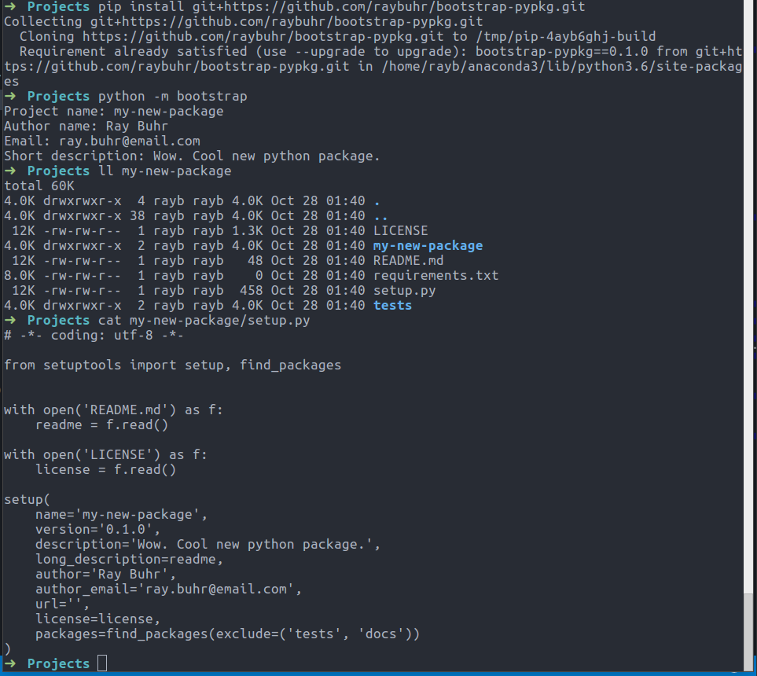

# bootstrap-pypkg

Minimal CLI to help create new python packages

## Install

`pip install git+https://github.com/raybuhr/bootstrap-pypkg.git`

## Usage

You can bootstrap a new python package by entering the command in your terminal:

`python -m bootstrap`

This will prompt you for a few key items:

* Project name: 
  - a name for your new package/project, should not include spaces or special characters other than - or _
* Author name:
  - your name or your company, organization, etc.
* Email:
  - a contact email in case people using your people really need to get hold of you
* Short description:
  - a concise explanation of the package, aiming for only 1 or 2 sentences 

Those prompts will then automatically build a new directory for your package with the following structure:

```
package-name\
  LICENSE
  README.md
  requirements.txt
  setup.py
  package-name\
    __init__.py
    package-name.py
  tests\
    __init__.py
    test_package-name.py
```

This structure gives your package:

* a `LICENSE` file
* a `README.md` that you can expand for the longer description, as well as installation and usage instructions
* an empty `requirements.txt` for you to list your package dependencies 
  - use `pip freeze > requirements.txt` from the top-level directory of your package
* a directory for `tests`
* a subdirectory of the same name where you'll write the main logic
* a `setup.py` file with metadata about your package so you can install it via pip and share it with other people



You should notice that the info you entered in the prompts is built into the `setup.py` (as in screenshot above).
In addition to adding in code for your package, you should get in the habit of also updating the version number in 
this `setup.py` file. There are different strategies for how to do this, but one simple method is:
`version='MAJOR.minor.updates'` 
`MAJOR` would be a **stable** release that people can expect some bug fixes and new features, but not large sweeping/breaking changes. 
`minor` would be new features or maybe updates that break usage or deprecate functions.
`updates` would be bug fixes, minor changes to features, or pretty much any other change to the code base. 

*Note:*
Typically, it is good habit to have a workspace for python projects. 
If you have one, `cd` into it from your terminal (command prompt). 
If you do not have a python project workspace, make one. 
You can do this from your file browser, or from terminal with `mkdir python`.
From terminal, navigate to your python workspace, e.g. `cd python`. 

## Inspiration

This package is heavily influenced by https://github.com/kennethreitz/samplemod/ and http://docs.python-guide.org/en/latest/writing/structure/. 

I made it because I wanted something even more minimal, that I would actually use instead of cloning and updating/tweaking the `samplemod` project. 
